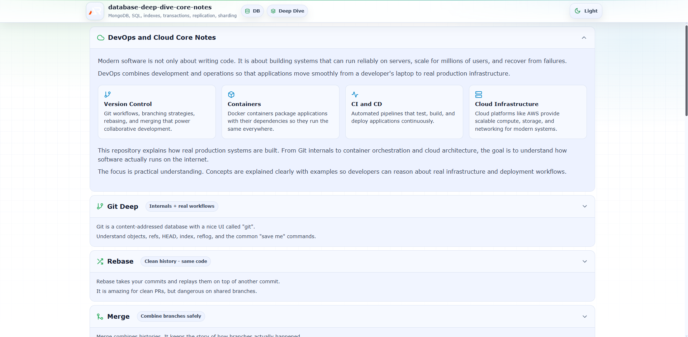

# DevOps and Cloud Core Notes

A structured collection of practical notes covering modern **DevOps practices, cloud fundamentals, containerization, CI/CD pipelines, and infrastructure concepts**.

This repository is part of the **Core Notes series**, designed to help developers understand how software moves from **source code to production systems running on the internet**.

## The goal is to provide **clear, beginner friendly explanations with practical insights** into real engineering workflows used in modern backend and cloud environments.

---

## Topics Covered

### Git Deep

Understanding how Git actually works internally.

- commits, trees, blobs
- HEAD and branches
- reflog
- reset vs revert
- stash and cherry pick

### Rebase

Working with linear commit history.

- what rebase is
- interactive rebase
- squash and fixup
- conflict resolution
- when not to use rebase

### Merge

Understanding how Git combines branches.

- fast forward merge
- three way merge
- merge conflicts
- merge strategies
- pull request merge methods

### Hooks

Automating actions during Git workflow.

- pre commit hooks
- pre push hooks
- running tests automatically
- linting before commits
- security checks

### Docker

Introduction to containerization.

- Docker vs virtual machines
- images and containers
- layers
- volumes
- environment variables

### Containers

How containers isolate and run applications.

- container lifecycle
- namespaces and cgroups concept
- logging and inspection
- resource limits

### Dockerfile

Building container images.

- FROM
- WORKDIR
- COPY
- RUN
- CMD vs ENTRYPOINT
- multi stage builds

### Networking

Basic networking concepts for containers and systems.

- ports and port mapping
- bridge networks
- container to container communication
- DNS inside containers

### CI/CD

Automating build and deployment pipelines.

- continuous integration
- continuous delivery
- pipeline stages
- build artifacts
- deployment workflows

### GitHub Actions

Automating development workflows.

- workflows
- jobs and steps
- runners
- caching dependencies
- secrets management

### Cloud Basics

Core concepts used across cloud providers.

- regions and availability zones
- compute vs storage vs networking
- shared responsibility model
- pay as you go pricing

### AWS EC2

Virtual machines in the cloud.

- instances
- SSH access
- security groups
- key pairs
- user data scripts

### S3

Object storage system.

- buckets and objects
- public vs private access
- static website hosting
- lifecycle policies

### IAM

Managing identity and access control.

- users
- groups
- roles
- policies
- least privilege principle

### Load Balancer

Distributing traffic across servers.

- why load balancing is needed
- layer 4 vs layer 7
- health checks
- high availability

### Reverse Proxy

Routing and protecting backend services.

- reverse proxy vs forward proxy
- request routing
- SSL termination
- caching

### Nginx

A widely used web server and reverse proxy.

- serving static files
- proxy_pass configuration
- load balancing basics
- gzip compression
- rate limiting

---

## Tech Stack

- React (Vite)
- styled-components
- react-icons

---

## Purpose of This Repository

These notes are designed to help developers understand **how modern software systems are built, deployed, and operated in production environments**.

The repository focuses on:

- practical concepts
- real engineering workflows
- beginner friendly explanations
- production oriented thinking

---

## Repository Status

Work in progress. New topics and improvements will be added regularly.

---

## Follow Me

- GitHub: https://www.github.com/a2rp
- Portfolio: https://www.ashishranjan.net
- LinkedIn: https://www.linkedin.com/in/aashishranjan
- Facebook: https://www.facebook.com/theash.ashish/
- Youtube: https://www.youtube.com/@ashishranjan-ashz

## Links

- Portfolio: [https://www.ashishranjan.net](https://www.ashishranjan.net)
- GitHub: [https://github.com/a2rp](https://github.com/a2rp)
- CodePen: [https://codepen.io/ash1198](https://codepen.io/ash1198)
- LinkedIn: [https://www.linkedin.com/in/aashishranjan](https://www.linkedin.com/in/aashishranjan)
- Facebook: [https://www.facebook.com/theash.ashish/](https://www.facebook.com/theash.ashish/)
- YouTube: [https://www.youtube.com/@ashishranjan-ashz?sub_confirmation=1](https://www.youtube.com/@ashishranjan-ashz?sub_confirmation=1)
- Email: [ash.ranjan09@gmail.com](mailto:ash.ranjan09@gmail.com)

## Support

- Support: [https://a2rp-donation-page.netlify.app/](https://a2rp-donation-page.netlify.app/)
- Buy Me A Coffee: [https://buymeacoffee.com/a2rp](https://buymeacoffee.com/a2rp)
- Patreon: [https://patreon.com/a2rp](https://patreon.com/a2rp)