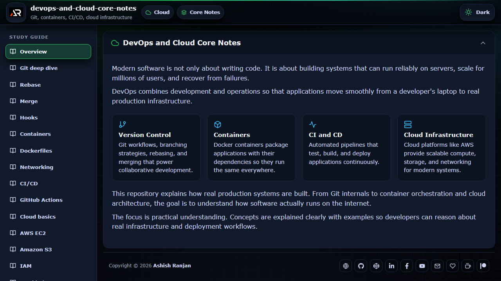

# DevOps and Cloud Core Notes

Practical React notes for Git, containers, CI/CD, AWS, cloud infrastructure, and production workflows.



## Features

- Topic-based notes with lazy-loaded routes
- Fixed study navigation with internal scrolling
- Dark and light themes with local preference storage
- Responsive layout, local assets, footer links, and go-to-top control

## Tech stack

React, Vite, React Router, styled-components, and React Icons.

## Run locally

```bash
npm install
npm run dev
```

Build and deploy to GitHub Pages:

```bash
npm run build
npm run deploy
```

## Links

- Portfolio: [https://www.ashishranjan.net/](https://www.ashishranjan.net/)
- GitHub: [https://github.com/a2rp](https://github.com/a2rp)
- CodePen: [https://codepen.io/ash1198](https://codepen.io/ash1198)
- LinkedIn: [https://www.linkedin.com/in/aashishranjan](https://www.linkedin.com/in/aashishranjan)
- Facebook: [https://www.facebook.com/theash.ashish/](https://www.facebook.com/theash.ashish/)
- YouTube: [https://www.youtube.com/@ashishranjan-ashz?sub_confirmation=1](https://www.youtube.com/@ashishranjan-ashz?sub_confirmation=1)
- Email: [mailto:ash.ranjan09@gmail.com](mailto:ash.ranjan09@gmail.com)

## Support

- Support: [https://a2rp-donation-page.netlify.app/](https://a2rp-donation-page.netlify.app/)
- Buy Me a Coffee: [https://buymeacoffee.com/a2rp](https://buymeacoffee.com/a2rp)
- Patreon: [https://www.patreon.com/a2rp](https://www.patreon.com/a2rp)
